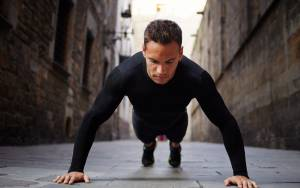

<!-- markdownlint-disable MD033 -->

With this program, you will never plan or worry about the weight or the load. Auto-regulate based on how you feel daily based on other lifestyle factors like nutrition, sleep quality/hygiene, and stress. We will be squatting during the movement prep portion of the training session, so as to not neglect the pattern but to focus on other movements.

Most important is that you start and finish the program. That is ultimately the secret to success in any endeavor.

<figure class="figure">
    
    <figcaption class="figure__caption">Title</figcaption>
</figure>

A large posterior chain movement. In this case we are using the hinge pattern, so either kettlebell hinge, deadlift, or swing.
An upper body push. We will use standing overhead presses, 1/2 kneeling, or tall kneeling presses.
An upper body pull, such as pull-ups, rows, or batwings.
A simple, full-body explosive movement. Kettlebell swings do the trick.
A loaded carry and crawling at the end.
A large posterior chain movement. In this case we are using the hinge pattern, so either kettlebell hinge, deadlift, or swing.
An upper body push. We will use standing overhead presses, 1/2 kneeling, or tall kneeling presses.
An upper body pull, such as pull-ups, rows, or batwings.
A simple, full-body explosive movement. Kettlebell swings do the trick.
A loaded carry and crawling at the end.
