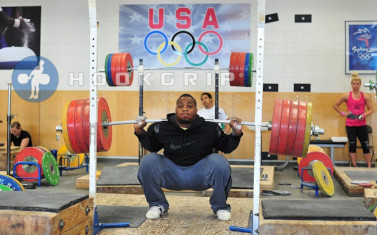

<!-- markdownlint-disable MD033 -->

A large posterior chain movement. In this case we are using the hinge pattern, so either kettlebell hinge, deadlift, or swing.
An upper body push. We will use standing overhead presses, 1/2 kneeling, or tall kneeling presses.
An upper body pull, such as pull-ups, rows, or batwings.
A simple, full-body explosive movement. Kettlebell swings do the trick.
A loaded carry and crawling at the end.
A large posterior chain movement. In this case we are using the hinge pattern, so either kettlebell hinge, deadlift, or swing.
An upper body push. We will use standing overhead presses, 1/2 kneeling, or tall kneeling presses.
An upper body pull, such as pull-ups, rows, or batwings.
A simple, full-body explosive movement. Kettlebell swings do the trick.
A loaded carry and crawling at the end.

<figure class="slika">
    
  
</figure>

A large posterior chain movement. In this case we are using the hinge pattern, so either kettlebell hinge, deadlift, or swing.
An upper body push. We will use standing overhead presses, 1/2 kneeling, or tall kneeling presses.
An upper body pull, such as pull-ups, rows, or batwings.
A simple, full-body explosive movement. Kettlebell swings do the trick.
A loaded carry and crawling at the end.
A large posterior chain movement. In this case we are using the hinge pattern, so either kettlebell hinge, deadlift, or swing.
An upper body push. We will use standing overhead presses, 1/2 kneeling, or tall kneeling presses.
An upper body pull, such as pull-ups, rows, or batwings.
A simple, full-body explosive movement. Kettlebell swings do the trick.
A loaded carry and crawling at the end.
